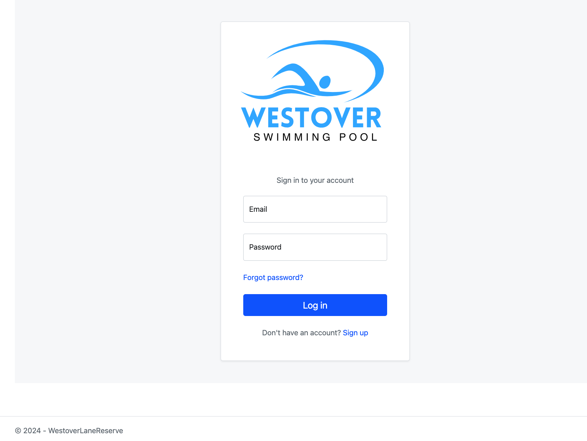
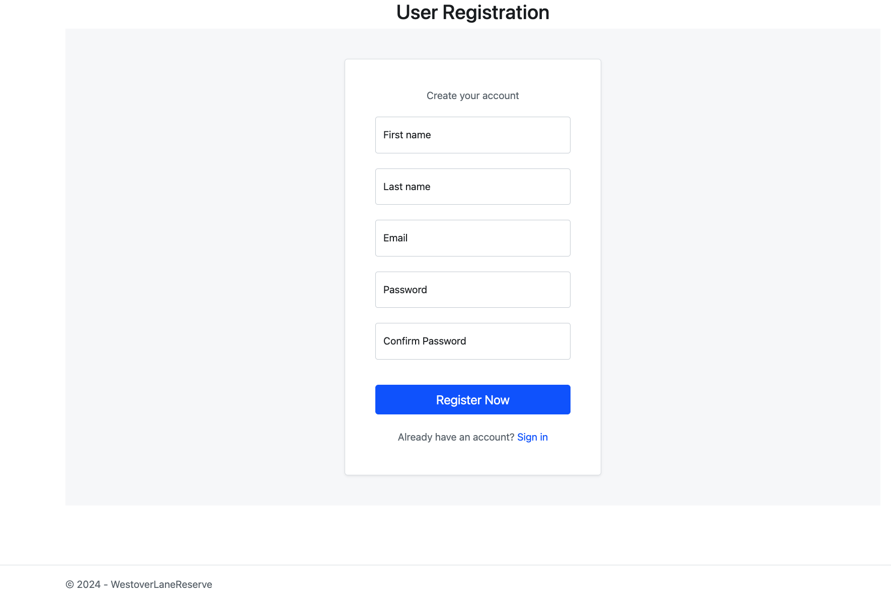
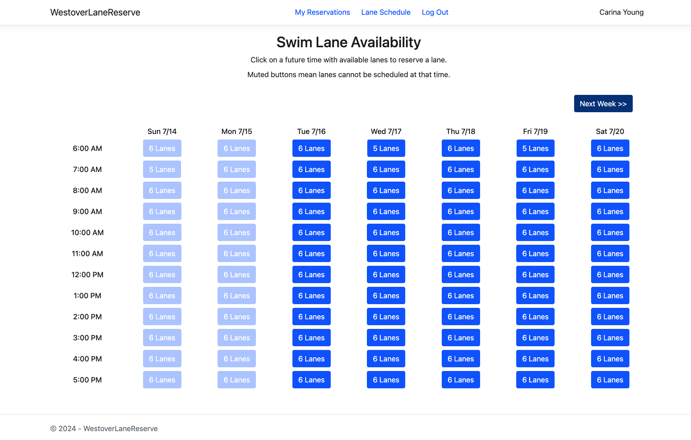
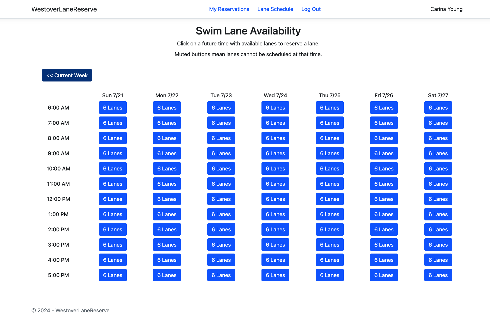
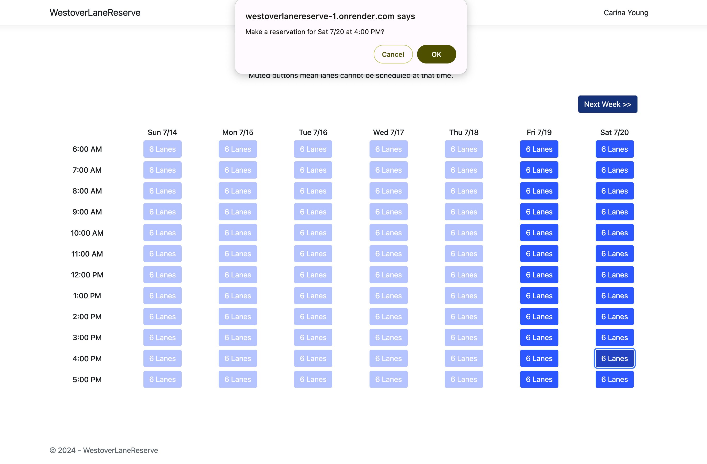
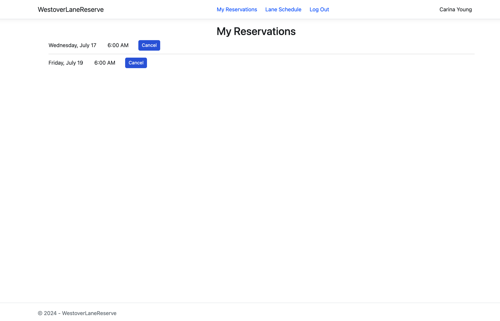

# Westover Swim Lane Reservation website

### Background
I needed a capstone project for my Software Engineering degree - I'm a swimmer, and my local pool only takes lap-lane reservations over the phone or in person. I've wondered how hard it would be to make on online lane-reservation website, so I thought I'd give it a go... 

I decided to use C# and ASP.NET Core to build the web app. Both were new to me, as my coursework was mostly in Java, but I found C# was similar enough to Java. I also used Bootstrap and a bit of Javascript, and connected a SQLite database. I've now decided I'm totally a fan of the Razor Pages page-model system over a traditional MVC format! 

I liked the outcome. It could use some tidying and a couple of things should be changed (authorization needs some work) but in general I enjoyed the project and would be happy to use Razor Pages in the future. 

I containerized the file using Docker and deployed the app to the cloud. Check it out here: https://westoverlanereserve.onrender.com

### Website screenshots:
The sign-in page:

&nbsp;
 

&nbsp;
 

User registration page:

&nbsp;
 

&nbsp;
 

The website has two weeks available for reservations, the current week and the following week. Each available hour in a particular day has 6 lane slots. When a user clicks on a time slot, the lane availibility count goes down by one. Once the beginning of a slot time has passed, the slot color mutes to a lighter blue, and the slot is no longer available for reservations. 

&nbsp;
 

Current week:

&nbsp;
 

&nbsp;
 

Following week:

&nbsp;
 

&nbsp;
 

When a user clicks on a time slot, a reserve message pops up:

&nbsp;
 

&nbsp;

If they navigate to the "My Reservations" page, a user can see their upcoming reservations, and cancel reservations if needed:  

&nbsp;
   

